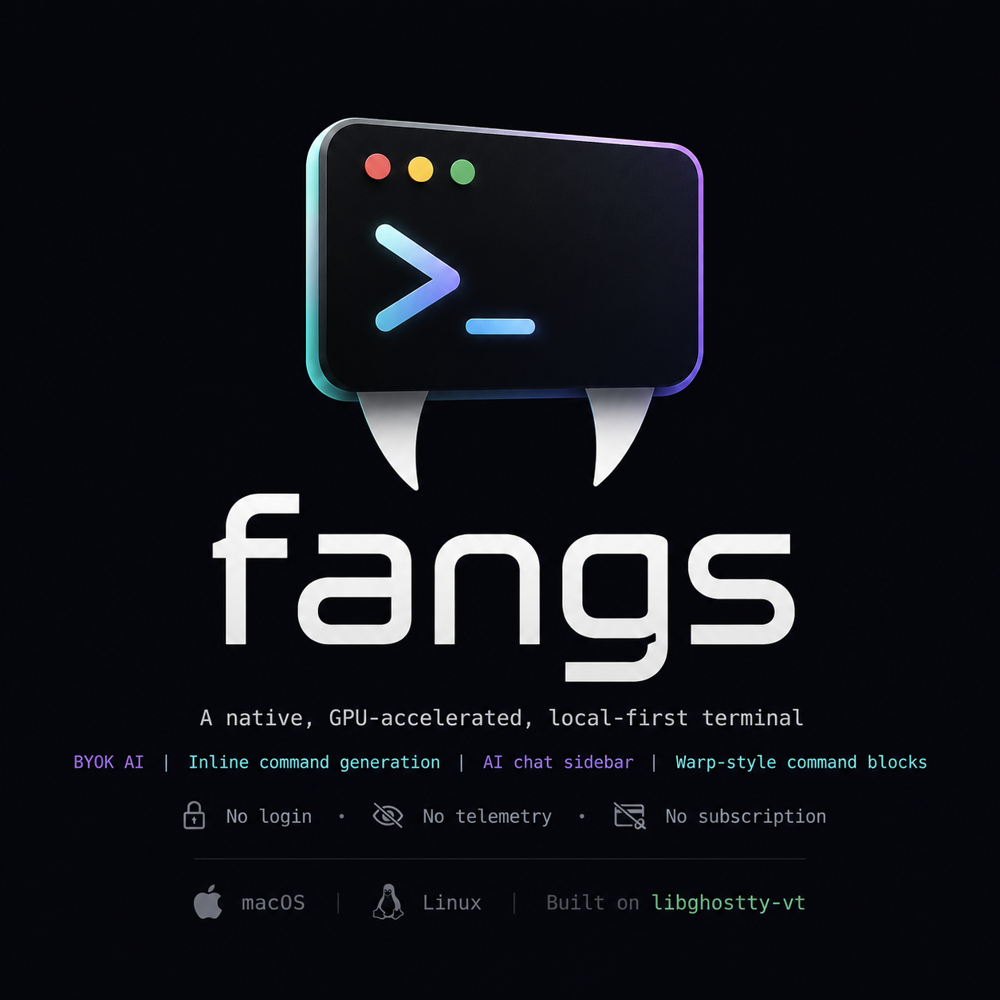

<div align="center">



<br>

**A native, GPU-accelerated terminal with the AI you actually want — and none of the lock-in.**

Inline command generation, an AI chat sidebar that reads your screen, and Warp-style command
blocks. **Local-first and bring-your-own-key** — one binary, no account, no Fangs cloud; point it at
your own API key or run a fully local model.

[](LICENSE)
[](https://github.com/rene-rodriguez/fangs/releases/latest)


</div>

Fangs is a single local binary for **macOS and Linux**, built on Ghostty's
[`libghostty-vt`](https://libghostty.tip.ghostty.org/) terminal engine and rendered with
[Raylib](https://www.raylib.com/). No account, no telemetry, no subscription.

## Why Fangs

Warp put genuinely useful AI in the terminal — then locked it behind an account, cloud telemetry,
and a subscription, and rendered its UI with non-standard TTY blocks. Fangs keeps the features and
drops the rest:

- **No account, no telemetry.** One local binary. You never sign in to use your own terminal.
- **Local-first & BYOK.** Fangs has no backend of its own — it connects straight from your machine
  to the endpoint *you* choose: Anthropic's native API, any OpenAI-compatible endpoint, or a
  **fully local** model via Ollama or llama.cpp. Your key lives on your disk, and scrollback is
  redacted on-device before anything is sent.
- **A real, standard terminal.** The VT layer is Ghostty's `libghostty-vt` — inspectable and
  community-maintained. Fangs never intercepts your shell's stdin to fake visual "blocks"; every AI
  feature is an overlay in the render pipeline, so the PTY byte stream stays pure.

## Features

- **Workspace rail** &nbsp;cmux-style vertical workspaces on the left, built for running several
  coding agents side by side. Each row shows the agent/window title (or the project directory),
  the git branch, and an attention dot with the latest unread event — background output, a failed
  command, a dead session, or an agent ringing for input via BEL / OSC 9 / OSC 777 (the channels
  Claude Code uses). Click a row to switch, click **+** for a new same-directory workspace (or
  **Option/Alt-click** it to create an isolated git worktree under `.worktrees/`), click the
  notification strip — or press `Cmd+Shift+U` — to jump straight to the pane that needs you.
  The command palette also offers **New Worktree Workspace** for the same git worktree action.
  `Cmd+Shift+[` / `Cmd+Shift+]` cycle workspaces (`Ctrl+Shift+…` on Linux). Splits of the active
  workspace get their own section, and the rail compacts or hides on narrow windows; toggle it
  from the palette. Rename any workspace with `Cmd+Shift+R` (or the palette) — a custom name pins
  the row label, beating the agent title and directory; save an empty name to go back to automatic
  labels. Rows show up to three **dev-server port chips** (`:5173`) detected straight from PTY
  output — click one to open it in your browser; they clear on the next prompt. **Right-click** a
  row for Rename / New Worktree Here / Close; **middle-click** arms a close (click again to
  confirm, any other input disarms); **drag** a row to reorder workspaces. The bell button in the
  header opens a **notification history** popover of recent rings — click one to jump to that pane.
  Set `workspace_command` in the config to auto-type a command (e.g. `claude`) into every new
  worktree workspace you create interactively. Workspaces (cwd + name) are restored on launch by
  default — set `restore_session = false` to start fresh instead.
- **AI chat sidebar** &nbsp;`Cmd+B` / `Ctrl+Shift+B` — ask about what's on your screen. Fangs
  captures recent scrollback (redacted for keys, tokens, and passwords *before* it leaves your
  machine), streams the answer live, and keeps multi-turn context. Any command in the reply gets a
  **Run** button that stages it at your prompt — never auto-executed.
- **Inline command generation** &nbsp;`Ctrl+Space` — describe what you want in plain language
  (*"undo last git commit"*) and get the command staged at your prompt, no trailing newline. You
  review and press Enter yourself, always.
- **Command blocks** &nbsp;Warp-style, via OSC 133 — once your shell emits the marks, each command
  gets a separator, a colored gutter, and a **✓ / ✗ exit-status badge**; hover to copy its output,
  and jump between commands with `Cmd+↑` / `Cmd+↓`. A pure render overlay — the byte stream stays
  untouched. (See [`docs/shell-integration.md`](docs/shell-integration.md).)
- **Kitty image graphics** — static Kitty protocol images render in the grid, including PNG,
  RGBA, RGB, grayscale, and grayscale+alpha payloads. Useful for file previews, editor plugins,
  and CLI image tools; Sixel and animations are intentionally out of scope for now.
- **Command palette** &nbsp;`Cmd+P` / `Ctrl+Shift+P` — search and run built-in Fangs actions
  without memorizing every shortcut: panes, tabs, AI entry points, find, clipboard, settings, and
  font controls. It also picks up local runbooks from your global config and the current project,
  and lists every open workspace by name/title/directory so you can fuzzy-jump straight to one.
- **Live configuration** — an INI dotfile is the source of truth, with an in-app settings modal
  (`Ctrl+,`) that round-trips to it and hot-reloads instantly. No restarts.
- **First-class theming** — One Dark, Dark Modern, GitHub Dark, Gruvbox, Monokai, and light
  variants. Each themes the full 256-color palette in the engine, so *all* output is colored
  (`ls --color`, vim, prompts, 256-color apps), and the UI restyles to match.
- **Terminal essentials** — mouse selection with copy/paste (bracketed-paste safe),
  `Ctrl`/`Cmd`+click to open URLs, and `Ctrl+F` find-in-view.

## Install

### Quick install (macOS app, Linux CLI)

```sh
curl -fsSL https://raw.githubusercontent.com/rene-rodriguez/fangs/main/install.sh | sh
```

Detects your OS and CPU, downloads the matching asset from the
[latest release](https://github.com/rene-rodriguez/fangs/releases/latest), and installs the
native launch target for your platform. macOS installs `Fangs.app` under `~/Applications`;
Linux installs the CLI under `~/.local` (`bin/fangs` plus the bundled `libghostty-vt`,
resolved via a relative RPATH).

| Option | How |
|---|---|
| Install the macOS app elsewhere | `curl … \| FANGS_APP_DIR=/Applications sh` |
| Force the CLI install on macOS | `curl … \| FANGS_INSTALL=cli sh` |
| Install the CLI to a custom prefix | `curl … \| FANGS_PREFIX=/usr/local sh` |
| Pin a specific version | `curl … \| FANGS_VERSION=v0.1.3 sh` |
| Authenticate a private mirror | `curl … \| FANGS_GITHUB_TOKEN=… sh` (also reads `GH_TOKEN` / `GITHUB_TOKEN`) |

Until Developer ID signing is configured, the macOS app asset is published as an unsigned
tester zip. If macOS blocks the first launch, right-click `Fangs.app` and choose Open once.

Prebuilt targets: **Linux x86_64** and **macOS arm64** (Apple Silicon). **Intel Macs** and any other
target build from [source](#build-from-source) — the installer prints exactly how if no prebuilt
binary matches. Releases are built by CI (`.github/workflows/release.yml`) on every `v*` tag.

### Build from source

Requires **CMake 3.19+**, **Ninja**, a C compiler, and **libcurl**. Zig **0.15.2** compiles
`libghostty-vt` at build time, but you don't have to install it — the build scripts fetch the
pinned version into `vendor/` for you (`scripts/bootstrap-vendor.sh`, run automatically).

> **Zig version matters.** Fangs pins `libghostty-vt` to a commit that builds with Zig **0.15.2**.
> Arch/CachyOS `pacman` currently ships 0.16.0, which won't build the pin — so the scripts vendor
> 0.15.2 rather than relying on `PATH`. (Already have 0.15.2 on `PATH`? It's used as-is on Linux.)

```bash
# Linux / CachyOS — bootstraps Zig 0.15.2, then builds
sudo pacman -S --needed cmake ninja base-devel git curl
bash scripts/linux-build.sh
./build/fangs

# macOS — bootstraps Zig 0.15.2 + handles the Zig 0.15.2 ↔ macOS SDK workaround
bash scripts/macos-build.sh
./build/fangs
```

Rebuilds are incremental and fast: `cmake --build build` (after the first scripted build, the
vendored Zig and the FetchContent deps are cached).

- **Arch / CachyOS:** build a package straight from `packaging/aur/` (`makepkg -si`) — it fetches the
  pinned Zig for you. See [`packaging/aur/README.md`](packaging/aur/README.md).
- **macOS:** `scripts/macos-bundle.sh` produces a relocatable, self-contained `Fangs.app`
  (plus a distributable zip); a Homebrew **cask** lives in `packaging/macos/`. See
  [`packaging/macos/README.md`](packaging/macos/README.md).

## Keybindings

| Keys | Action |
|---|---|
| `Cmd+P` / `Ctrl+Shift+P` | Command palette |
| `Ctrl+,` / `Cmd+,` | Settings modal (font, theme, AI provider / model / key) |
| `Cmd+B` / `Ctrl+Shift+B` | Toggle the AI chat sidebar |
| `Ctrl+Space` | Inline command generation — describe a command, get it staged |
| `Cmd+Shift+/` / `Ctrl+Shift+/` | Ask AI about the latest command block |
| `Cmd+↑` / `Cmd+↓` (or `Ctrl+↑` / `Ctrl+↓`) | Jump to previous / next command block |
| `Cmd+T` / `Ctrl+Shift+T` | New tab |
| `Cmd+W` / `Ctrl+Shift+W` | Close focused pane (last pane closes the tab; last tab exits) |
| `Cmd+1`–`9` / `Ctrl+Shift+1`–`9` | Select tab 1–9 |
| `Cmd+Shift+[` / `]` (Linux: `Ctrl+Shift+[` / `]`) | Previous / next workspace |
| `Cmd+Shift+U` / `Ctrl+Shift+U` | Jump to the most urgent unread pane |
| `Cmd+Shift+R` / `Ctrl+Shift+R` | Rename the active workspace (empty resets to auto) |
| `Cmd+D` / `Ctrl+Shift+D` | Split focused pane right |
| `Cmd+Shift+D` / `Ctrl+Shift+Alt+D` | Split focused pane down |
| `Cmd+Opt+←/→/↑/↓` / `Ctrl+Shift+←/→/↑/↓` | Move focus between panes |
| `Cmd` / `Ctrl` + `=` / `-` / `0` | Increase, decrease, or reset font size |
| Drag · `Cmd+C` / `Ctrl+Shift+C` | Select text · copy the selection |
| `Cmd+V` / `Ctrl+Shift+V` / `Shift+Insert` | Paste (bracketed-paste safe) |
| `Ctrl` / `Cmd` + click a URL | Open it (`open` / `xdg-open`) |
| `Ctrl+F` / `Cmd+F` | Find — highlights matches in view (Esc closes) |

## Configuration

Settings live in `~/.config/fangs/config` (INI), editable in-app via `Ctrl+,` (`Cmd+,` on
macOS). **Save** writes the file and hot-reloads live — font size resizes the grid, theme changes
apply instantly, no restart.

Kitty image rendering is enabled by default. Advanced users can disable it or tune the storage
budget in the dotfile with `kitty_images = false` or `kitty_image_storage_mb = 64`.

The AI features are **bring-your-own-key**: set the **`FANGS_API_KEY`** environment variable
(preferred), or store a key in the settings modal (written `0600`). When the env var is set, the
modal greys out the key field and shows *(from env)*. The key is never logged.

Pick your provider in the settings toggle:

- **anthropic** — the native Claude API (`x-api-key`, `/v1/messages`).
- **openai** / **ollama** / **custom** — any OpenAI-compatible endpoint (hosted or local).

Switching the provider prefills a sensible default endpoint and model. Scrollback sent to the model
is run through a redaction pass first, terminal context is attached only to the current question,
and both the sidebar's Run buttons and inline generation stage commands without a newline — so you
always press Enter yourself.

### Runbooks

The command palette also loads local runbooks from:

- `~/.config/fangs/workflows`
- `.fangs/workflows` or `.fangs/workflows.ini` in the active session's project tree

Runbooks are refreshed whenever the palette opens. Selecting one stages its command at the prompt;
it does not press Enter for you.

With shell integration enabled, the command palette action **Save Latest Command as Runbook**
appends the most recent command block's command to the active project's `.fangs/workflows` file.
If the project has no `.fangs` or `.git` marker above the active session, Fangs writes to
`.fangs/workflows` under the active session's current directory.

```ini
[workflow.test]
label = Run Tests
command = cmake --build build && ctest --test-dir build --output-on-failure
detail = Build and run the full test suite

[workflow.status]
command = git status --short

[workflow.test_one]
label = Test File
command = ctest --test-dir build -R {{name}}
detail = Run one CTest by name

[workflow.grep]
label = Search Source
command = rg "{{query}}" {{path=src}}
detail = Search a path, defaulting to src
```

Use `{{name}}` for required variables and `{{name=default}}` for defaults. Fangs prompts for each
variable and then stages the expanded command at the prompt.

## Project layout

```
src/            main.c · pty · term_engine (libghostty-vt seam) · config (INI)
                ui_settings (Ctrl+, modal) · layout · ui_sidebar (chat panel)
                ai_provider + ai_http (AI seam) · sse · context + redact
                cmdextract (Run buttons) · ui_inline (Ctrl+Space)
                action_registry + workflows + ui_palette + ui_workflow_prompt (Cmd+P)
                cmdblocks + cmdblocks_osc (OSC 133) · theme · raygui.h / cJSON.c (vendored)
tests/          config · layout · ui_sidebar_model · action_registry · workflows
                ui_palette_model · sse · redact · cmdextract · inline_cmd · theme · cmdblocks_osc  (ctest)
assets/         embedded font (JetBrains Mono, OFL)
scripts/        build, bundle, and release packaging
packaging/      aur/ (Arch · CachyOS) · macos/ (Homebrew cask)
docs/           plan.md · spec.md · shell-integration.md · handoff notes
```

Two narrow seams keep the project honest: `term_engine.h` wraps the VT engine
(`spawn / write / resize / render / dump_text`), and `ai_provider.h` wraps the AI transport
(`send(messages, on_token)`). Swapping the engine or a provider touches a single file.

## Remote control

Fangs exposes a local JSON-over-Unix-socket API to control workspaces and
sessions programmatically, plus a `fangs ctl` CLI front-end.

### Security

The socket lives at `~/.config/fangs/remote.sock` with mode `0600`. It is
**never** a TCP listener. Both config gates default to **false**:

```ini
[remote]
remote_api = false        # enables the socket + benign commands (list, focus,
                          # rename, read, ring)
remote_api_send = false   # additionally enables send and new --run (arbitrary
                          # command execution by design, same trust model as
                          # tmux send-keys or kitty remote control)
```

### Usage (CLI)

```sh
fangs ctl list                      # list workspaces
fangs ctl new --worktree --name fix-auth --run "claude"   # spawn agent
fangs ctl send 2 "run the tests\n"  # type into a workspace
fangs ctl read 2 --lines 80         # read screen text
fangs ctl ring 2 "review me"        # mark attention
fangs ctl rename fix-auth --index 2 # rename a workspace
fangs ctl focus 1                   # switch to workspace 1
```

### Orchestrator recipe

Enable both gates, run a Claude Code orchestrator in workspace 1, and give it
`fangs ctl` — it can spawn worktree workspaces for sub-agents, poll `list` for
`working` / `attention`, `read` their screens, and `send` follow-ups. This is
the cmux orchestration story on fangs' own socket:

```sh
# Orchestrator spawns sub-agents via:
fangs ctl new --worktree --name agent-bot --run "claude --model claude-sonnet-4-20250514 --allowedTools"
# Check if they need attention:
fangs ctl list
# Read a sub-agent's screen:
fangs ctl read 2 --lines 80
# Send follow-up instructions:
fangs ctl send 2 "run the tests now\n"
```

See [`docs/workspace-ops-spec.md`](docs/workspace-ops-spec.md) for the full
protocol reference.

## Documentation

- [`docs/plan.md`](docs/plan.md) — roadmap and architecture decisions.
- [`docs/spec.md`](docs/spec.md) — technical spec (modules, build, config, AI provider).
- [`docs/shell-integration.md`](docs/shell-integration.md) — OSC 133 shell snippets (zsh / bash) for command blocks.
- [`docs/workspace-ops-spec.md`](docs/workspace-ops-spec.md) — remote control protocol, port detection, rail ergonomics.

## License

Fangs is released under the **MIT License** — see [`LICENSE`](LICENSE). The same license as
upstream Ghostty, it lets anyone use, modify, and redistribute Fangs (including commercially) with
attribution and no warranty.

The only bundled third-party asset is the **JetBrains Mono** font (embedded for the terminal/UI),
under the **SIL Open Font License 1.1** — shipped verbatim as `LICENSE-OFL-JetBrainsMono.txt` in
every release. The OFL places no restriction on Fangs's own source license. Everything else Fangs
links (libcurl, OpenGL, X11/Wayland) is a system library, and `libghostty-vt` is built from pinned
upstream Ghostty source.
